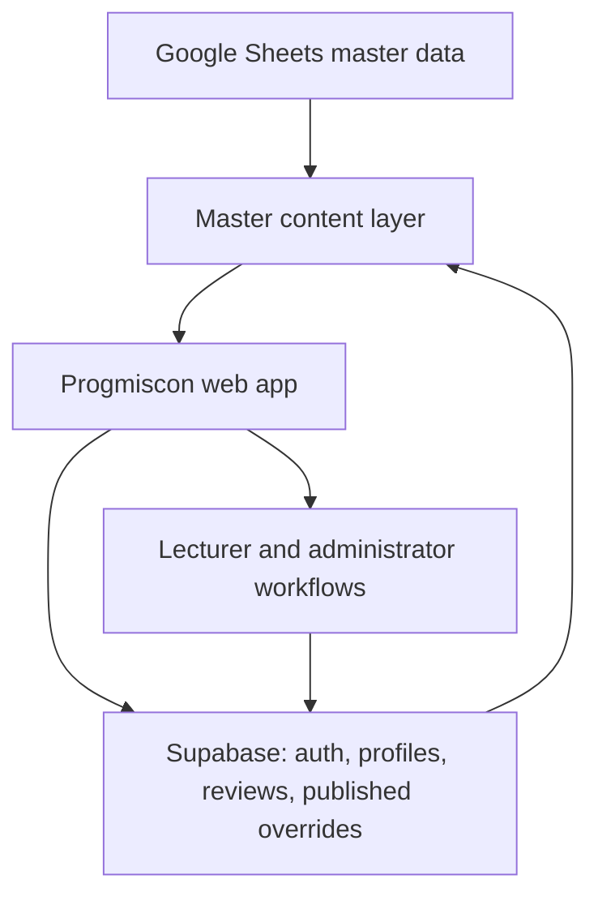

# Progmiscon

Progmiscon is a web application for exploring introductory programming questions, the
concepts behind them, and the misconceptions that commonly appear in student answers.
It also provides a structured review workflow that lets lecturers check and refine the
misconception labels attached to that content.

## Overview

Introductory programming students often hold specific, recurring misconceptions. A
wrong answer is usually not random: it reflects a particular misunderstanding of a
concept such as execution order, expression evaluation, or input and output handling.

Progmiscon organizes teaching content around that idea. Each question is linked to one
or more concepts and to the misconceptions it can reveal. Answer options and recorded
answer variations are linked to the misconceptions they express. On top of this
content model, lecturers can review the misconception mapping for a question and record
corrections, and an administrator can publish an agreed correction so that it takes
effect in the application.

Progmiscon is not a grading system, a learning management system, or an analytics
dashboard. The focus is the relationship between questions, concepts, misconceptions,
and answer variations, and keeping that mapping accurate over time.

## Features

### Question bank

- Browse questions by concept and by week.
- Question detail view with localized prose, pseudocode and code blocks, input and
  output descriptions, sample cases, and multiple-choice options.
- Explore recorded answer variations for a question and filter them by misconception.

### Concepts and misconceptions

- Concept pages that group related questions and the misconceptions attached to a
  concept.
- Misconception pages that show a description, a correction, common causes, contrasting
  correct and incorrect examples where available, related misconceptions, and the
  questions where the misconception appears.

### Bilingual content

- Indonesian and English, switchable at any time. Indonesian is the default.
- Localized fields for concepts, misconceptions, question prose, and review copy.
- Multiple-choice options support both a legacy single-text form and a bilingual form
  with separate Indonesian and English text.

### Lecturer review

- Lecturer accounts authenticate through Supabase. Sign-up is limited to an approved
  institutional email domain and requires email verification.
- A week-first review workspace lists questions and shows how many reviewers each
  question already has.
- For a question, a reviewer records whether the current misconception mapping is
  correct, which misconceptions should be removed and why, which should be added and
  why, and an optional note.
- Each question accepts up to three active reviewers.
- A reviewer can see and revise their own review history.

### Administration

- Question management: inspect a question, edit an application-side content override,
  and reset the review workflow for a single question when needed.
- Review management: view current and past reviews across all reviewers, see per
  question review status, and publish an agreed correction once a question has three
  active reviewers. Publishing writes an application-side override to the effective
  misconception mapping.
- Exports: download the current effective questions, answers, and relation tables, and
  the current review records, as CSV files.

## Architecture

Content originates in an owner-maintained Google Sheets workbook, which acts as the
canonical master data source. The web application reads that content, merges any
published application-side overrides stored in Supabase, and renders the result.
Lecturer and administrator workflows run against Supabase.



The application can also run entirely on bundled mock data, without Google Sheets, for
local development and UI work. The data source is selected with an environment
variable.

### Effective content model

The content shown in the application is the canonical master data plus any published
overrides. Overrides are produced by the administrator workflow:

- Content overrides adjust question or answer text.
- Misconception overrides adjust the misconception mapping for a question, based on the
  consensus of three reviewers.

Overrides are merged on the client each time master data is loaded.

## Tech stack

- React 19 with TypeScript
- Vite 8 build tooling
- React Router 7 for client-side routing
- Tailwind CSS 4 (via the Tailwind Vite plugin)
- Supabase (`@supabase/supabase-js`) for authentication and application data
- PapaParse for reading published Google Sheets CSV exports
- lucide-react for icons
- oxlint for linting

## Content model

At a conceptual level:

- A question belongs to one or more concepts (topics) and targets one or more
  misconceptions.
- A question has answer entries. Multiple-choice options and recorded answer variations
  are both stored as answers with a role.
- An answer entry can be linked to the misconceptions it expresses, each with an
  optional reason.
- A misconception belongs to a concept and can be linked to related misconceptions.

The master data workbook holds these as separate tabs: topics, misconceptions,
questions, question and topic relations, question and misconception relations, answers,
answer and misconception relations, and similar-misconception relations.

## Localization

The interface and content support Indonesian (`id`) and English (`en`). Language is
held in application state and can be toggled from the navigation bar. Indonesian is the
initial language.

Localized values are stored as a pair of Indonesian and English strings. Where only one
language is present for a given field, that value is used for both. Multiple-choice
options accept either a single `text` value, used unchanged in both languages, or a
bilingual pair of `text_ind` and `text_en`. Providing both forms for the same option is
rejected as an authoring error.

Localization coverage of long-form concept and misconception material is still being
expanded.

## Review workflow

The review workflow operates on questions.

1. A lecturer opens the review workspace and selects a week, then a question.
2. The workspace shows the question, its recorded answers, and the current misconception
   mapping.
3. The lecturer submits a review: whether the mapping is correct, misconceptions to
   remove with a reason, misconceptions to add with a reason, and an optional note.
4. A question can have up to three active reviewers. Reviews are recorded against the
   current source version of the question content.
5. When a question has three active reviewers, an administrator can publish the
   consensus. This writes an application-side override to the effective misconception
   mapping for that question.

Ordinary edits to canonical content do not deactivate existing reviews. Refreshing the
baseline content for a question keeps its active reviews attached. Clearing the reviews
for a question is a separate, deliberate administrator action available in question
management.

An earlier answer-level review workflow has been retired. Links to it now redirect to
the question review workspace.

## Getting started

### Prerequisites

- Node.js 22 or newer. Several repository check scripts use the native TypeScript
  stripping flag, which requires a recent Node.js release.
- npm.
- A Supabase project for authentication and application data.
- For the Google Sheets data source: published CSV export URLs for each master data
  tab. The application can run on bundled mock data without this.

### Install

```bash
npm install
```

### Environment configuration

Create a `.env.local` file. `.env.example` lists the minimum set. The variables fall
into these categories:

Supabase (always required):

```
VITE_SUPABASE_URL=...
VITE_SUPABASE_PUBLISHABLE_KEY=...
```

Data source selection:

```
VITE_DATA_SOURCE=mock
```

`VITE_DATA_SOURCE` accepts `mock` or `sheets`. With `mock`, the application uses bundled
sample data. With `sheets`, the following published CSV URLs are also required:

```
VITE_SHEET_TOPICS_URL=...
VITE_SHEET_MISCONCEPTIONS_URL=...
VITE_SHEET_QUESTIONS_URL=...
VITE_SHEET_QUESTION_TOPICS_URL=...
VITE_SHEET_QUESTION_MISCONCEPTIONS_URL=...
VITE_SHEET_ANSWERS_URL=...
VITE_SHEET_ANSWER_MISCONCEPTIONS_URL=...
VITE_SHEET_SIMILAR_MISCONCEPTIONS_URL=...
```

Do not commit real values. `.env` files are ignored by git.

### Local development

```bash
npm run dev
```

### Build and preview

```bash
npm run build
npm run preview
```

`npm run build` runs the TypeScript project build and then the Vite production build.

### Linting

```bash
npm run lint
```

### Repository checks

The repository includes a set of Node-based check scripts used while developing content
handling and the review lifecycle. They are run individually, for example:

```bash
npm run check:question-detail
npm run check:effective-overrides
npm run check:review-v3-contract
npm run check:review-v3-replay
npm run check:canonical-sync-plan
```

Most checks run offline against fixtures. Scripts whose name ends in `:live` reach the
live master data source and are not part of the normal local loop.

## Project structure

```text
src/
  app/          Application shell and route definitions
  components/   UI components, grouped by area (review, admin, concept, misconception, layout, navigation)
  config/       Data source configuration
  data/         Bundled mock data for the mock data source
  hooks/        Data-loading and state hooks, including language and lecturer auth
  pages/        Route-level pages
  services/     Repository layer for master data, Supabase, reviews, and overrides
  types/        TypeScript type definitions
  utils/        Content parsing, review logic, filters, and formatting helpers
  styles/       Global styles
checks/         Node-based check scripts and fixtures
scripts/        Developer and owner-run tooling
supabase/       Database migrations
database/       Migration archive and replay material
docs/           Additional documentation
```

## Deployment

The frontend is deployed on Vercel as a single-page application, with a rewrite that
routes all paths to `index.html`. Application data and authentication are provided by a
Supabase project. Environment variables are configured in the hosting project rather
than in the repository.

## Project status

Progmiscon is an active research and teaching software project.

Working today:

- The public question, concept, and misconception views.
- Indonesian and English localization of the interface and the localized content
  fields.
- Supabase-backed lecturer authentication and the question review workspace.
- The three-reviewer consensus model and administrator publishing of overrides.
- CSV exports of current content and review records.
- Selectable mock or Google Sheets data source.

Ongoing work:

- Expanding localization coverage across canonical content.
- Continued validation and cleanup of canonical content.
- UI refinement in the review and administration areas.
